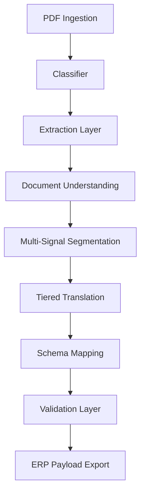

# Nazli PDF-to-JSON: Architecture & Repository Structure

This document outlines the system architecture and directory structure for the Japanese Purchase Document extraction pipeline.

## 1. System Architecture

The system follows a **Modular Pipes-and-Filters Architecture** orchestrated by a NestJS-based state machine. It is designed to transform unstructured Japanese PDF documents into highly deterministic, validated JSON payloads ready for ERP ingestion.

### High-Level Data Flow

### Core Components
1. **Orchestrator**: Manages the state of each document through the pipeline stages (INGEST -> CLASSIFY -> EXTRACT -> ... -> OUTPUT).
2. **Marker Sidecar**: A Python-based FastAPI service running the `marker-pdf` engine for high-fidelity OCR and layout detection.
3. **Understanding Layer**: Reconstructs fragmented OCR blocks into semantic structures (tables, key-value pairs).
4. **Segmentation Service**: Uses weighted signals (column fingerprints, keyword similarity) to split multi-document PDFs.
5. **Translation Engine**: A tiered approach (Glossary -> Rule-based -> AI Fallback) with "Identifier Shielding" to prevent VIN/Chassis corruption.
6. **Validation & Quality Gate**: Enforces strict math (Subtotal + Tax = Total) and distribution checks.

---

## 2. Repository Structure

### `/src` - Application Source
- **`/common`**: Shared guards, interceptors, and global schemas.
- **`/database`**: Prisma schema and migration scripts.
- **`/modules`**:
    - **`orchestrator/`**: The pipeline state machine.
    - **`extraction/`**: Clients for Marker and legacy backends.
    - **`understanding/`**: Table reconstruction and block normalization.
    - **`segmentation/`**: Multi-signal document splitting.
    - **`translation/`**: Deterministic glossary and AI-powered translation.
    - **`normalization/`**: Data cleansing (dates, currency, characters).
    - **`schema-mapper/`**: Purchase-specific mapping and ERP adapter.
    - **`validation/`**: Quality gates and distribution audit.
    - **`documents/`**: API controllers and storage management.
- **`/scripts`**: Evaluation and regression testing tools.

### `/marker-sidecar` - Python OCR Service
- `server.py`: FastAPI application.
- `Dockerfile`: Production-ready environment for marker-pdf.

### `/datasets` - Regression Testing
- **`purchase/clean/`**: Standard, high-quality documents + ground truth.
- **`purchase/noisy/`**: Skewed, multi-page, or low-res documents + ground truth.

---

## 3. Technology Stack
- **Framework**: NestJS (Node.js)
- **Database**: PostgreSQL + Prisma ORM
- **Cache**: Redis + BullMQ
- **OCR Engine**: Marker-PDF (Python)
- **AI/LLM**: GPT-4o / Claude 3.5 (via LangChain/Custom clients)
- **Validation**: Zod + Custom Math Validators
- **DevOps**: Docker Compose

## 4. Operational Guardrails
- **Zero-Hallucination Policy**: Identifiers (VIN/Chassis) are shielded from AI translation.
- **Fail-Fast Math**: Documents with >1% math variance are flagged for manual review.
- **Pipeline Determinism**: Heuristic branching is minimized in favor of weighted signal clustering.
